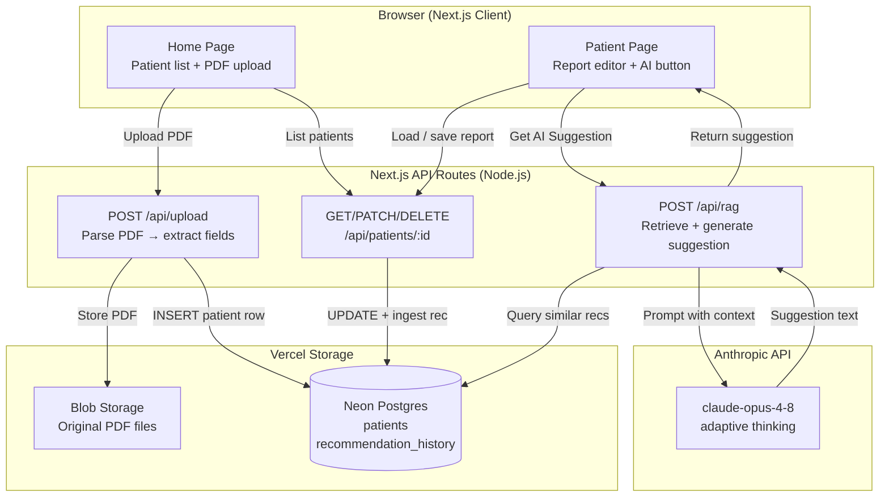
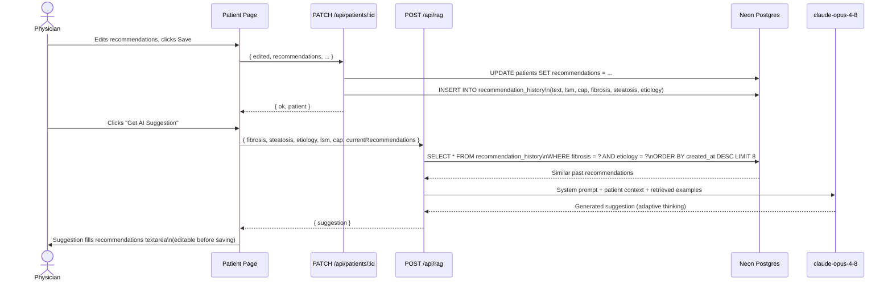
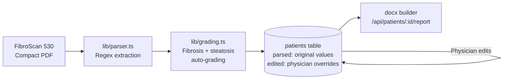
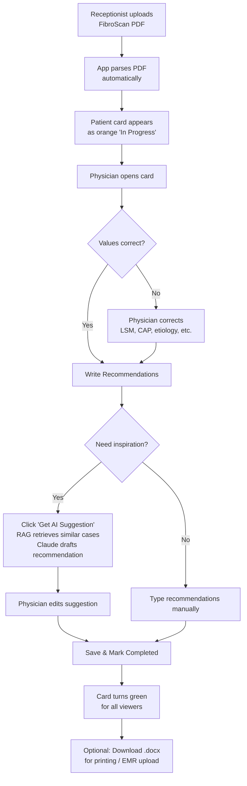

# FibroScan Reviewer - DEMO

A web application for reviewing, editing, and signing off FibroScan 530 Compact reports. Receptionists upload PDFs; reading physicians verify auto-graded values, write recommendations with AI assistance, and mark reports completed — all changes shared in real time via a shared URL.

---

## System Architecture



---

## RAG Pipeline (Recommendation AI)

Every time a physician saves non-empty recommendations, the text is automatically ingested into `recommendation_history` alongside the patient's clinical context (LSM, CAP, fibrosis stage, steatosis grade, etiology). When the physician clicks **Get AI Suggestion**, the RAG endpoint retrieves the most relevant past recommendations and sends them to Claude as few-shot examples.



---

## Data Flow: PDF Upload → Report



The `parsed` column stores raw values from the PDF. The `edited` column stores only fields the physician changed. The final report merges them: `{ ...parsed, ...edited }`.

---

## Project Structure

```
app/
├── page.tsx                    # Home: patient list + PDF upload
├── layout.tsx                  # Shell: header, global styles
├── patients/[id]/
│   └── page.tsx                # Report editor with RAG suggestion button
└── api/
    ├── upload/route.ts         # POST: ingest PDF, create patient record
    ├── patients/
    │   ├── route.ts            # GET all patients
    │   └── [id]/
    │       ├── route.ts        # GET / PATCH / DELETE one patient
    │       └── report/route.ts # GET: generate .docx download
    └── rag/route.ts            # POST: retrieve similar recs + AI suggestion

lib/
├── db.ts                       # Neon Postgres helpers + schema init
├── grading.ts                  # Fibrosis (LSM) and steatosis (CAP) grading
└── parser.ts                   # PDF text extraction + field regex

public/                         # Static assets
```

---

## Database Schema

```sql
-- Patient reports
CREATE TABLE patients (
  id               uuid PRIMARY KEY DEFAULT gen_random_uuid(),
  patient_name     text NOT NULL,
  patient_code     text,
  date_of_exam     text,
  parsed           jsonb NOT NULL,           -- raw values from PDF
  edited           jsonb NOT NULL DEFAULT '{}', -- physician overrides
  recommendations  text NOT NULL DEFAULT '',
  indication       text NOT NULL DEFAULT '',
  additional_notes text NOT NULL DEFAULT '',
  status           text NOT NULL DEFAULT 'in_progress', -- or 'completed'
  pdf_blob_url     text,
  created_at       timestamptz NOT NULL DEFAULT now(),
  updated_at       timestamptz NOT NULL DEFAULT now()
);

-- RAG: recommendation history for AI retrieval
CREATE TABLE recommendation_history (
  id         uuid PRIMARY KEY DEFAULT gen_random_uuid(),
  patient_id uuid NOT NULL REFERENCES patients(id) ON DELETE CASCADE,
  text       text NOT NULL,
  lsm        numeric,
  cap        numeric,
  fibrosis   text,   -- e.g. 'F0-F1', 'F2', 'F3', 'F4'
  steatosis  text,   -- e.g. 'S0', 'S1', 'S2', 'S3'
  etiology   text,   -- e.g. 'NAFLD/MASLD', 'Hepatitis B', ...
  created_at timestamptz NOT NULL DEFAULT now()
);
```

Both tables are created automatically on first request via `ensureSchema()` in `lib/db.ts` — no manual migrations needed.

---

## API Reference

| Method | Route | Description |
|--------|-------|-------------|
| `POST` | `/api/upload` | Upload a FibroScan PDF; creates a patient record |
| `GET` | `/api/patients` | List all patients, ordered by `updated_at DESC` |
| `GET` | `/api/patients/:id` | Fetch one patient record |
| `PATCH` | `/api/patients/:id` | Update fields + ingest recommendations into RAG history |
| `DELETE` | `/api/patients/:id` | Delete patient and cascade-delete recommendation history |
| `GET` | `/api/patients/:id/report` | Stream a `.docx` report for download |
| `POST` | `/api/rag` | Retrieve similar past recs and generate an AI suggestion |

### `POST /api/rag` — request body

```json
{
  "patientId": "uuid",
  "fibrosis": "F2",
  "steatosis": "S1",
  "etiology": "NAFLD/MASLD",
  "lsm": 7.8,
  "cap": 290,
  "currentRecommendations": "optional draft text"
}
```

Returns `{ "ok": true, "suggestion": "..." }`.

---

## Medical Thresholds

All grading logic lives in [`lib/grading.ts`](./lib/grading.ts) with inline citations.

### Steatosis (CAP, dB/m)

Default: **Karlas 2017** IPD meta-analysis (n=2,735, mixed etiology). For NAFLD/MASLD, the app automatically switches to **Eddowes 2019** biopsy-validated cutoffs.

| Grade | Karlas (default) | Eddowes (NAFLD/MASLD) | Histology |
|-------|------------------|-----------------------|-----------|
| S0 | < 248 | < 302 | < 11% hepatocytes (< 5% for NAFLD) |
| S1 | 248 – 267 | 302 – 330 | 11–33% (mild) |
| S2 | 268 – 279 | 331 – 336 | 34–66% (moderate) |
| S3 | ≥ 280 | ≥ 337 | > 66% (severe) |

CAP ≥ 275 dB/m triggers the **AASLD 2024 / EASL 2021** rule-in flag for any steatosis.

### Fibrosis (LSM, kPa)

Etiology-specific cutoffs applied per EASL CPG 2021, WHO 2024 (HBV), Castera (HCV), Nguyen-Khac (ALD).

| Stage | NAFLD/MASLD | Hep C | Hep B | ALD |
|-------|-------------|-------|-------|-----|
| F0-F1 | < 7.0 | < 7.1 | < 7.0 | < 7.5 |
| F2 | 7.0 – 8.6 | 7.1 – 9.4 | 7.0 – 8.0 | 7.5 – 9.4 |
| F3 | 8.7 – 10.2 | 9.5 – 12.4 | 8.1 – 10.9 | 9.5 – 12.4 |
| F4 | ≥ 10.3 | ≥ 12.5 | ≥ 11.0 | ≥ 12.5 |

Global EASL 2021 flags: **rule-out** < 8 kPa (advanced fibrosis unlikely), **rule-in** ≥ 12.5 kPa (advanced fibrosis likely).

LSM reliability is flagged per EASL/AGA: IQR/Median ≤ 30% (or ≤ 20% if LSM < 7.1 kPa).

---

## Local Development

### Prerequisites

- Node.js ≥ 18
- A Neon (or any Postgres) database
- An Anthropic API key (for the AI suggestion feature)

### Setup

```bash
git clone <your-repo>
cd fibroscan-reviewer
npm install

# Pull environment variables from Vercel (if deployed):
vercel link && vercel env pull .env.local

# Or create .env.local manually:
cat > .env.local <<EOF
POSTGRES_URL=postgresql://...
BLOB_READ_WRITE_TOKEN=...
ANTHROPIC_API_KEY=sk-ant-...
EOF

npm run dev
```

Open [http://localhost:3000](http://localhost:3000).

### Environment Variables

| Variable | Required | Description |
|----------|----------|-------------|
| `POSTGRES_URL` | Yes | Neon / Postgres connection string |
| `POSTGRES_DATABASE_URL` | Fallback | Vercel preview environment alias |
| `BLOB_READ_WRITE_TOKEN` | Yes | Vercel Blob token for PDF storage |
| `ANTHROPIC_API_KEY` | Yes (for RAG) | Anthropic API key for AI suggestions |

---

## Deployment

See **[DEPLOY.md](./DEPLOY.md)** for a step-by-step, no-command-line Vercel guide (~10 minutes).

After deploying, add `ANTHROPIC_API_KEY` in Vercel → your project → **Settings → Environment Variables**, then redeploy.

---

## Clinic Workflow



---

## Tech Stack

| Layer | Technology |
|-------|-----------|
| Framework | Next.js 14 (App Router) |
| Language | TypeScript |
| Styling | Tailwind CSS |
| Database | Neon Postgres via `@neondatabase/serverless` |
| File storage | Vercel Blob |
| PDF parsing | `pdf-parse` + custom regex |
| Report generation | `docx` (programmatic .docx builder) |
| AI / RAG | Anthropic `claude-opus-4-8` via `@anthropic-ai/sdk` |
| Deployment | Vercel |
